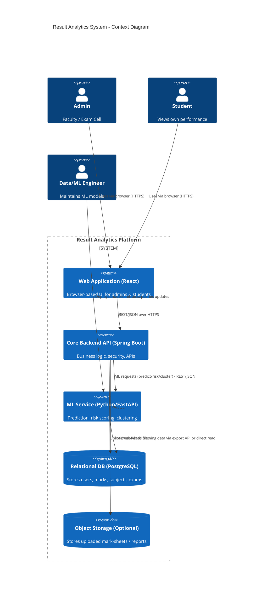

Yes, 100% you can turn this into a **proper AI/ML project** – not just a CRUD result portal.

Think of it as:

> **“AI-driven Student Result Analysis & Performance Prediction System”**
> with **Admin + Student roles + ML engine** under the hood.

Let me show you **how to add AI/ML layers** on top of your web app so that it becomes a strong academic / portfolio project.

---

## 1️⃣ Core Idea: What Makes It an AI/ML Project?

You keep the same base:

* Web app
* Admin role (upload/manage results)
* Student role (view results)

Then you add **AI/ML features** like:

1. **Performance Prediction**

   * Predict each student’s **next exam score** or **final result**.
   * Algorithms: Linear Regression / Random Forest / XGBoost / simple Neural Net.

2. **Risk of Failure / Dropout Alert**

   * Classify students into **Low / Medium / High risk** based on:

     * Past marks
     * Attendance
     * Subject difficulty
     * Internal assessment
   * Algorithms: Logistic Regression, Random Forest, XGBoost, SVM.

3. **Personalized Recommendations**

   * For each student:

     * “You are weak in *Math Algebra* & *Digital Electronics*.”
     * “Focus more on Unit 2 & 3; attempt at least 3 previous papers.”
   * Can be rule-based + ML + simple NLP.

4. **Student Segmentation (Clustering)**

   * Cluster students into:

     * High performers but inconsistent
     * Average but improving
     * Consistently low performers
   * Algorithms: K-Means / K-Medoids.

5. **Subject Difficulty Analytics**

   * Automatically infer **which subjects are “hard”**:

     * Low average, high failure rate → difficult
     * High variance → conceptual confusion.
   * Optionally model this in ML for difficulty scoring.

6. **Natural Language Insights (NLP / LLM)**

   * “Explain my performance in simple language.”
   * “What are the weak areas of Batch A?”
   * Use a **Python service with LLM (local or API)** to convert data → human-friendly explanations.

---

## 2️⃣ Suggested Tech Stack (Mixed Web + AI)

### 🔹 Web App (same as before)

* **Frontend:** React + TypeScript
* **Backend (Core API & Auth):** Spring Boot + Spring Security + JWT
* **Database:** PostgreSQL

### 🔹 AI/ML Service (separate)

Since ML is easier in Python:

* **AI Service:** Python (FastAPI or Flask)
* **ML Libraries:** scikit-learn, pandas, NumPy
* Optional: XGBoost, LightGBM
* Optional for NLP: Hugging Face, spaCy, or OpenAI/Gemma API

**Architecture:**

* Web & Java backend = main system
* Python ML service = `/ml/predict`, `/ml/risk`, `/ml/cluster` endpoints
* Java calls Python service → React consumes Java APIs.

This also looks **very good in an architecture diagram** for a project/dissertation.

---

## 3️⃣ Data You’ll Use for ML

From your system, you’ll already have:

* Student profile (branch, class, gender, background – if available)
* Subject-wise marks across multiple exams
* Attendance (if you add it)
* Internal assessment marks
* Previous batch history (for training)

You can create ML **feature sets** like:

* Average marks per subject
* Trend (improving / declining)
* #backlogs
* Difficulty index of subjects taken

Then train models offline, save them (pickle/joblib), and load in your **Python ML microservice**.

---

## 4️⃣ Example AI Features in the UI

### 👨‍🏫 Admin Dashboard

* **List of at-risk students** with reasons:

  * “High risk in DBMS – 3 low scores in last 3 tests”
* **Subject difficulty heatmap**
* **Batch comparison with AI commentary:**

  * “Batch 2025 is weaker in Algorithms compared to Batch 2024 by 12%.”

### 🎓 Student Dashboard

* “Your predicted score in next DBMS test: 68 ± 5”
* “You are strong in C Programming, weak in OS.”
* “Recommended focus areas: OS – Process Scheduling, Memory Management.”

---

## 5️⃣ Making It a Strong AI/ML Project (for CV / M.Tech / CDAC context)

You can position the project as:

> **“AI-driven Student Performance Prediction & Result Analytics Portal”**
> **Key Contributions:**
>
> * Web-based portal with role-based access (Admin/Student)
> * Machine learning models for prediction and risk analysis
> * Clustering to segment students
> * AI-generated recommendations using simple NLP/LLM

### Chapters / Sections (if academic):

1. Problem Definition & Motivation
2. Literature Survey (existing result systems, learning analytics)
3. System Design (Architecture: Web + ML microservice)
4. Data Preprocessing & Feature Engineering
5. ML Model Selection, Training & Evaluation
6. System Implementation (Screenshots + API design)
7. Results, Discussion, Future Enhancements

---

## 6️⃣ Roadmap: How to Proceed Practically

**Phase 1 – Core Web App (2–3 weeks)**

* Implement login, admin, student roles
* CRUD for students, subjects, exams, marks
* Basic charts: marks vs subject, batch performance

**Phase 2 – ML Engine (2–3 weeks)**

* Export historical data → CSV
* Build notebooks → train models (regression, classification, clustering)
* Wrap models in FastAPI/Flask → expose `/predict`, `/risk`, `/cluster`

**Phase 3 – Integration + UX (1–2 weeks)**

* Connect Spring Boot → Python ML service
* Show predictions in React dashboards
* Add explanations & recommendation text

---

### ✅ Direct Answer to Your Question

> **Yes, you can absolutely create this project in AI/ML.**
> In fact, it’s *perfect* for an AI/ML + web + analytics combo:
>
> * Web portal for results = base
> * ML models for prediction, risk, clustering = AI layer
> * Optionally LLM for natural language insights = GenAI layer

If you want, next I can help you with **either**:

* A **detailed architecture diagram + component list**, or
* A **concrete list of ML models + features to use**, or
* A **step-by-step plan: exactly what to code first**.
---
Here’s a detailed architecture for your **AI/ML-driven Result Analysis System** with **Admin + Student** roles, plus a **clear component list** you can directly map to your implementation.

---

## 1️⃣ High-Level Architecture (System Context)



---

## 2️⃣ Container-Level Architecture

Think of 5 main containers:

1. **Frontend Web App (React)**
2. **Core Backend API (Spring Boot)**
3. **AI/ML Microservice (Python + FastAPI/Flask)**
4. **Database (PostgreSQL)**
5. **Infrastructure (Nginx, Docker, CI/CD, Monitoring)**

```mermaid
flowchart LR
  subgraph Browser
    UI[React Web App]
  end

  subgraph Backend["Core Backend - Spring Boot"]
    CTRL[REST Controllers]
    SVC[Service Layer]
    SEC[Spring Security + JWT]
    JPA[JPA Repositories]
    INT[ML Service Client]
    FILE[File Upload Module]
    SCH[Scheduler (optional)]
  end

  subgraph ML["ML Service - Python (FastAPI)"]
    MAPI[Prediction API]
    PREP[Preprocessing & Feature Builder]
    MODEL[Trained Models (.pkl)]
    TRAIN[Offline Training Pipeline]
  end

  subgraph DB["PostgreSQL"]
    T_USER[(users)]
    T_STUD[(students)]
    T_SUB[(subjects)]
    T_EXAM[(exams)]
    T_RES[(results)]
    T_AUD[(audit_logs)]
    T_FEAT[(ml_features_optional)]
  end

  subgraph INFRA["Infra"]
    NGINX[Nginx / Reverse Proxy]
    OBJ[(Object Storage - e.g. MinIO/S3)]
    CI[CI/CD - Jenkins/GitHub Actions]
    MON[Monitoring - Prometheus/Grafana]
  end

  UI -->|HTTPS| NGINX -->|/api/*| CTRL
  UI -->|/static| NGINX

  CTRL --> SEC
  CTRL --> SVC
  SVC --> JPA --> DB
  SVC --> FILE --> OBJ
  SVC --> INT --> MAPI
  MAPI --> PREP --> MODEL
  TRAIN --> MODEL
  TRAIN -->|reads historical data| DB

  MON --> Backend
  MON --> ML
  CI --> Backend
  CI --> ML
```

---

## 3️⃣ Component List – Detailed Breakdown

### 🖥️ A. Frontend (React + TypeScript)

**1. Layout & Shell**

* `AppShell`

  * Header (brand, logged-in user, logout)
  * Sidebar (menu items vary by role)
  * Toast/notification component

**2. Auth Module**

* `LoginPage`
* `RegisterPage` (optional, or admin-only creation)
* `AuthContext` / Redux slice for:

  * JWT storage & refresh
  * Current user & role (`ADMIN`, `STUDENT`, maybe `TEACHER`)
* `ProtectedRoute` / `RequireAuth` wrapper

**3. Admin Module**

* `AdminDashboard`

  * KPI cards: total students, pass %, average score
  * Quick links: upload results, view analytics
* `StudentManagement`

  * Student list + filters (batch, class, year)
  * CRUD operations
* `SubjectManagement`

  * Add/edit subjects, map to classes
* `ExamManagement`

  * Create exams (term, max marks, date, class)
* `ResultUpload`

  * CSV/Excel upload UI with preview
  * Validation (duplicate roll, missing subject, etc.)
* `AdminAnalytics`

  * Subject-wise performance graph
  * Batch comparison
  * Toppers & low scorers
  * “AI Insights” panel (calls ML APIs)

**4. Student Module**

* `StudentDashboard`

  * Overview card: current percentage, trend
  * Upcoming exams (optional)
* `MyResults`

  * Table of exams + marks per subject
  * Graphs: marks over time, subject-wise radar chart
* `MyAIInsights`

  * “Your strong/weak areas”
  * “Predicted next exam performance”
  * “Recommended focus topics”

**5. Shared Components**

* `DataTable` (sorting, pagination)
* `Charts` (Recharts/Chart.js wrappers)
* `ConfirmDialog`, `FormModal`
* `FileUploader`

---

### ⚙️ B. Core Backend (Spring Boot)

**Dependencies:**

* `spring-boot-starter-web`
* `spring-boot-starter-data-jpa`
* `spring-boot-starter-security`
* `jjwt` or `spring-security-oauth2-jose` for JWT
* `spring-boot-starter-validation`
* `postgresql` driver
* `flyway-core` (for schema migrations)
* `springdoc-openapi` (for Swagger)

**1. Security Components**

* `SecurityConfig`

  * HTTP security config, CORS, CSRF
  * Role-based access (`hasRole('ADMIN')`, `hasRole('STUDENT')`)
* `JwtAuthenticationFilter`
* `JwtTokenProvider`
* `CustomUserDetailsService`
* `PasswordEncoder` bean (BCrypt)

**2. Domain Entities (JPA)**

* `User` (id, username, email, passwordHash, roles)
* `Student` (id, user, rollNo, class, batch, year, etc.)
* `Subject` (id, name, code, credits)
* `Exam` (id, name, type, date, class, maxMarks)
* `Result` (id, student, exam, subject, marks)
* `AuditLog` (who, what, when)
* Optional:

  * `Attendance`
  * `FeatureSnapshot` (for ML debugging)

**3. Repositories**

* `UserRepository`
* `StudentRepository`
* `SubjectRepository`
* `ExamRepository`
* `ResultRepository`
* `AuditLogRepository`

**4. Services (Business Logic)**

* `AuthService`

  * Login, token generation
  * Admin-initiated user creation
* `StudentService`

  * CRUD, search filters, bulk import
* `SubjectService`
* `ExamService`
* `ResultService`

  * Save marks, update, delete
  * Bulk insert from parsed Excel
  * Compute aggregates as needed
* `AnalyticsService`

  * Subject-wise statistics
  * Class/batch-wise statistics
  * Pass/fail %, mean, median, SD
* `MLIntegrationService` (Important)

  * Build payloads and call Python ML service
  * Methods like:

    * `getPerformancePrediction(studentId)`
    * `getRiskScore(studentId)`
    * `getClustersForBatch(batchId)`
  * Internal `RestTemplate` / `WebClient` for HTTP calls

**5. Controllers (REST APIs)**

* `AuthController` (`/api/auth`)

  * `POST /login`
  * `POST /refresh`
* `AdminController` (`/api/admin`)

  * Manage users, students, subjects, exams
* `ResultController` (`/api/results`)

  * `POST /upload`
  * `GET /student/{id}`
  * `GET /exam/{id}/summary`
* `AnalyticsController` (`/api/analytics`)

  * `GET /batch/{id}/summary`
  * `GET /subject/{id}/difficulty`
* `AIController` (`/api/ai`)

  * `GET /student/{id}/prediction`
  * `GET /student/{id}/risk-score`
  * `GET /batch/{id}/clusters`

**6. File Handling**

* `FileStorageService`

  * For storing original CSV/Excel (optional)
  * Could use MinIO/S3 or local filesystem
* `ExcelParser`

  * Using Apache POI / EasyExcel to parse uploaded files into `Result` DTOs

**7. Scheduler (Optional)**

* `MLSyncScheduler`

  * Nightly job to:

    * Export latest results for all students
    * Call ML service for retraining trigger or feature refresh

---

### 🤖 C. AI/ML Service (Python + FastAPI)

**Environment/Libraries:**

* `fastapi`
* `uvicorn`
* `pandas`, `numpy`
* `scikit-learn`
* `joblib` / `pickle`
* Optionally `xgboost`, `lightgbm`

**1. API Layer**

* `main.py`

  * `POST /predict-score` → given student history, predict next exam score
  * `POST /risk-score` → classify risk (Low/Medium/High)
  * `POST /cluster-batch` → cluster all students in a batch
  * `POST /explain` (optional) → text explanation of metrics (rule/LLM-based)

**2. Feature Engineering Module**

* `feature_builder.py`

  * Functions to convert raw DB records → ML feature vector:

    * average marks per subject
    * last N exam scores
    * subject difficulty index
    * #backlogs or fails
    * attendance ratio (if available)

**3. Model Store**

* `models/score_predictor.pkl`
* `models/risk_classifier.pkl`
* `models/cluster_model.pkl`

**4. Training Pipeline**

* `train.py`

  * Loads CSV exported from system
  * Splits train/test
  * Trains models (regression, classification, clustering)
  * Evaluates and saves final models
* **(Optional)**: simple CLI or notebook for EDA

---

### 🗄️ D. Database (PostgreSQL)

* Proper indexing:

  * `idx_results_student_exam`
  * `idx_results_subject_exam`
* Views or materialized views:

  * `vw_batch_performance`
  * `vw_subject_difficulty`
* Optional:

  * Store ML metadata like:

    * `model_version`
    * `train_date`
    * `metrics`

---

### 🧱 E. Infrastructure & DevOps

* **Reverse Proxy:** Nginx

  * Routes `/` → React static build
  * Routes `/api/` → Spring Boot
  * Routes `/ml/` (optional, internal) → FastAPI
* **Docker:**

  * `Dockerfile` for Spring Boot
  * `Dockerfile` for React
  * `Dockerfile` for ML service
  * `docker-compose.yml` for local dev (backend + frontend + db + ml)
* **CI/CD:**

  * Jenkins / GitHub Actions pipeline:

    * Build → Test → Dockerize → Deploy
* **Monitoring:**

  * Spring Boot → Actuator + Prometheus
  * Logs → ELK / Loki
  * Health endpoints for ML service too

---

## 4️⃣ How You Can Use This

* You can **lift this directly** into:

  * A project proposal
  * An M.Tech / PG-Dissertation architecture chapter
  * Internal CDAC note / design doc
* You can also **start coding container-by-container**:

  1. DB schema + JPA entities
  2. Spring Boot REST + security
  3. React UI with dummy data
  4. Python ML service (offline first, then integrate)

If you want, next I can:

* Turn this into a **clean architecture diagram for your report (Mermaid → image description)**
* Or design the **exact database schema (CREATE TABLE SQL)**
* Or define **all REST endpoints with sample JSON request/response**.
---
Nice, this is the fun part 😄
Let’s pin down **exact ML problems, models, and features** you can use in your Result Analysis + AI system.

---

## 1️⃣ ML Tasks Overview

You can frame your system around 4 core ML problems:

1. **Score Prediction** – “What will this student score in the next exam/subject?”
2. **Risk of Failure Classification** – “Is this student at risk of failing?”
3. **Student Segmentation (Clustering)** – “What type of learner is this student?”
4. **Subject Difficulty Scoring (Analytics + Optional ML)** – “Which subjects are hard?”

I’ll give you a **concrete model + feature set** for each.

---

## 2️⃣ Score Prediction Model (Regression)

**Goal:** Predict **numeric marks** for a student in a specific subject in the next exam.

### 🔹 Target Variable

* `marks_next_exam` (0–100 or whatever your scheme is)

### 🔹 Recommended Models

Start simple → go stronger:

1. **Baseline**

   * `LinearRegression` (scikit-learn)
2. **Better**

   * `RandomForestRegressor`
3. **Best (Tabular, if dataset decent)**

   * `XGBRegressor` (XGBoost) or `GradientBoostingRegressor`

Use 2 models:

* **Model A**: Subject-wise prediction (per subject)
* **Model B**: Overall percentage prediction (per exam/term)

### 🔹 Feature Set (Per student + subject + exam context)

Think of one *row* as: “Student S in Subject X before Exam E”.

**A. Historical Performance (per subject X)**

* `subj_avg_mark` – average marks of this student in that subject so far
* `subj_last_mark` – marks in the last exam for that subject
* `subj_last2_avg` – avg of last 2 attempts in that subject
* `subj_best_mark` – max marks in that subject
* `subj_attempt_count` – how many times the subject has been attempted

**B. Overall Academic Behaviour**

* `overall_avg` – average of all subjects (previous term/overall)
* `overall_std_dev` – consistency (high std dev = inconsistent)
* `num_backlogs` – total failed subjects so far
* `num_fails_last_term` – count of failing grades in last term
* `trend_score` – improvement trend:

  * e.g. slope of marks vs exam_index for last 3–5 exams

**C. Exam & Subject Context**

* `exam_type` (one-hot): unit_test / midterm / end_sem
* `subject_difficulty_index` (see section 5)

  * e.g. previous batch avg in this subject
* `exam_weightage` – % contribution in final score

**D. Behavioural / Attendance (if available)**

* `attendance_ratio_subject` – attendance for this subject
* `attendance_ratio_overall`
* `assignment_completion_rate`
* `lab_performance_score` (if lab/internal eval exists)

**E. Student Profile (low-importance but useful)**

* `batch_year`
* `branch` (CS/IT/ETC) – one-hot encoded
* `category` (optional, only if ethically okay and needed, else skip)
* `admission_type` (lateral/regular, if relevant)

---

## 3️⃣ Risk of Failure Model (Classification)

**Goal:** Classify whether a student is at risk of failing in **next exam / term**.

### 🔹 Target Variable

Define label as:

* Binary:

  * `risk_label` = 1 if:

    * predicted or previous result < passing threshold OR
    * CGPA/percentage below cutoff
  * else `0`
* Or 3 levels:

  * `0 = Low risk`, `1 = Medium`, `2 = High risk`

### 🔹 Recommended Models

1. **Baseline**

   * `LogisticRegression`
2. **Better**

   * `RandomForestClassifier`
3. **Best**

   * `XGBClassifier` / `GradientBoostingClassifier`

You can also compare with:

* `SVC` (for smaller datasets)

### 🔹 Feature Set (mostly reusing from regression)

Use all from **Score Prediction**, plus some **risk-specific features**:

**A. Academic Risk Signals**

* `gpa_last_term` / `percentage_last_term`
* `gpa_trend` – slope over last 3 terms
* `num_backlogs_total`
* `num_backlogs_current_term`
* `num_subjects_below_40` (or your risk threshold)
* `failed_core_subject_flag` – 1 if key subject failed (e.g. Maths/DSA)

**B. Attendance & Behaviour**

* `overall_attendance_ratio`
* `subj_attendance_min` – minimum attendance in any subject
* `num_absent_in_internal_tests`
* `num_unsubmitted_assignments`

**C. Variability / Consistency**

* `std_dev_marks_all_subjects`
* `std_dev_marks_core_subjects_only`

**D. Difficulty Interaction**

* `num_difficult_subjects_enrolled` (subjects with high difficulty index)
* `avg_mark_in_difficult_subjects`

---

## 4️⃣ Student Segmentation (Clustering)

**Goal:** Group students into meaningful segments like:

* “High performing but inconsistent”
* “Low performing but improving”
* “Consistently average”
* “High potential, currently underperforming”

### 🔹 No target variable → Unsupervised.

### 🔹 Recommended Models

1. **Baseline & Simple**

   * `KMeans`
2. **With density-based**

   * `DBSCAN` (if you suspect odd outliers)
3. **If you want soft clustering**

   * `GaussianMixture`

### 🔹 Feature Set (Aggregated per student)

Each row = **one student**

**A. Aggregate Marks**

* `avg_mark_overall`
* `avg_mark_core_subjects`
* `avg_mark_non_core_subjects`
* `best_subject_avg`
* `worst_subject_avg`

**B. Trend Features**

* `marks_trend_over_time` (slope of total marks/percent vs exam index)
* `improvement_flag` – 1 if last term > previous term by X%

**C. Risk & Consistency**

* `num_backlogs_total`
* `num_fails_last_year`
* `marks_std_dev_overall`
* `marks_std_dev_core_subjects`

**D. Workload / Course Mix**

* `num_subjects_taken`
* `num_difficult_subjects`
* `num_electives`

**E. Behaviour (if you track)**

* `attendance_ratio_overall`
* `assignment_completion_rate`

After clustering, you **manually interpret clusters** (e.g., Cluster 0 = high performers, Cluster 1 = low but improving, etc.) and use that mapping in the UI.

---

## 5️⃣ Subject Difficulty Scoring (Analytics + Optional ML)

This can be done **without ML** but you can formalize it.

### 🔹 Simple Analytics Approach (Recommended)

For each subject:

* `avg_mark_subject` – across all students & attempts
* `pass_rate_subject` – fraction of students passed
* `std_dev_subject` – spread
* `difficulty_score` = function like:
  `difficulty = w1*(100 - avg_mark) + w2*(1 - pass_rate)*100 + w3*std_dev`

Then normalize and create grades:

* `0–30 = Easy`, `30–60 = Moderate`, `60+ = Difficult`

### 🔹 If You Still Want ML

You can treat difficulty prediction as:

* **Regression**: Predict `avg_mark_subject` from:

  * `num_students_taking_subject`
  * `is_core_subject`
  * `prerequisite_subjects_count`
  * `avg_previous_term_performance_of_students`
* Use `RandomForestRegressor` or `XGBRegressor`.

But honestly, **analytics + rules are enough** and easier to explain in reports.

---

## 6️⃣ Optional: Recommendation / “AI Insights” Layer

Not strictly ML-heavy, but very impressive:

**Goal:** Generate **personalized tips** like:

> “You are weaker in OS & DBMS, especially in Process Scheduling and Normalization. Focus on: [list of units].”

### Approach:

1. **Rule-based + Analytics**

   * Identify subjects where:

     * `student_mark < class_avg - threshold`
     * OR `student_mark < pass_threshold + buffer`
   * Flag them as “weak”.
2. **Template-based NLG**

   * Use if/else + jinja-style templates to generate text.
3. **Optional LLM Integration**

   * Send a summary JSON to an LLM:
     `{student_strengths: [...], weaknesses: [...], trend: ..., upcoming_exams: ...}`
   * Ask it: “Generate a 3-point study recommendation for this student in simple English.”

No need for a separate ML model unless you want to get fancy with ranking resources.

---

## 7️⃣ How to Organize Feature Tables

You can maintain:

1. **`student_exam_features` table**

   * One row per (student, exam, subject) used for **regression/classification**.
2. **`student_aggregate_features` table**

   * One row per student used for **clustering**.
3. **`subject_stats` view**

   * One row per subject used for **difficulty scoring**.

These can be materialized views or precomputed tables, updated via a nightly job.

---

If you want, next I can:

* Design **exact schemas** for `student_exam_features` and `student_aggregate_features` (with column names + types), or
* Help you **choose one problem as “main” (e.g. risk model)** and give a **full training + evaluation pipeline outline**.
---

Nice, let’s turn this from “big idea” into a **coding to-do list** 😄

Below is a **practical, step-by-step build plan** in the *exact order* I’d recommend you code things, given your stack:

> **React (frontend) + Spring Boot (backend) + PostgreSQL + Python ML service**

You can treat each step as a mini-milestone.

---

## PHASE 1 – Get the Core System Working (No ML Yet)

### ✅ Step 1: Define Data Model & DB Schema

**Goal:** Fix what tables/fields you will definitely need.

Create tables:

* `users`

  * `id, username, email, password_hash, role (ADMIN/STUDENT), is_active`
* `students`

  * `id, user_id (FK), roll_no, name, batch, branch, year`
* `subjects`

  * `id, code, name, semester, is_core`
* `exams`

  * `id, name, type (UNIT/MID/FINAL), date, batch, semester, max_marks`
* `results`

  * `id, student_id, subject_id, exam_id, marks_obtained`
* (optional) `audit_logs`, `attendance` later

👉 **Action:**

* Write `CREATE TABLE` scripts (or Flyway migrations).
* Set up PostgreSQL locally and test connections.

---

### ✅ Step 2: Bootstrap Spring Boot Project

**Goal:** Bare-minimum backend that runs and connects to DB.

* Create Spring Boot project with:

  * `spring-boot-starter-web`
  * `spring-boot-starter-data-jpa`
  * `spring-boot-starter-security`
  * `postgresql` driver
  * `spring-boot-starter-validation`
* Configure `application.yml`:

  * DB URL, username, password
* Create JPA entities for:

  * `User`, `Student`, `Subject`, `Exam`, `Result`
* Create Repositories:

  * `UserRepository`, `StudentRepository`, etc.

👉 **Check:**
Run sample `@RestController` → `GET /health` returns `"OK"`.

---

### ✅ Step 3: Implement Authentication & Roles (Spring Security + JWT)

**Goal:** You can log in as ADMIN or STUDENT and get a token.

* Create `SecurityConfig`
* Implement:

  * `UserDetailsService` using `UserRepository`
  * `PasswordEncoder` (BCrypt)
  * `JwtTokenProvider` (generate/validate)
  * `JwtAuthenticationFilter`
* API:

  * `POST /api/auth/login` → returns `{ token, role, name }`
* Seed some users:

  * One `ADMIN`
  * 2–3 `STUDENT` users

👉 **Check:**

* Call `/api/auth/login` with Postman, get JWT.
* Use JWT in `Authorization: Bearer <token>` for protected endpoints.

---

### ✅ Step 4: Core CRUD for Master Data (Students, Subjects, Exams)

**Goal:** Admin can manage all master data via APIs.

Create controllers + services:

* `StudentController`

  * `GET /api/admin/students`
  * `POST /api/admin/students`
  * `PUT /api/admin/students/{id}`
  * `DELETE /api/admin/students/{id}`
* `SubjectController`

  * Same CRUD
* `ExamController`

  * Same CRUD

All should be **secured** with `ROLE_ADMIN`.

👉 **Check:**
Using Postman, verify CRUD operations and DB persistence.

---

### ✅ Step 5: Result Upload & Retrieval

**Goal:** Admin can upload marks; students can view their own results.

**Admin Side APIs:**

1. **Bulk upload (later with Excel), start simple:**

   * `POST /api/admin/results` – body: list of `{studentId, examId, subjectId, marks}`
2. **Fetch result summary for an exam/class:**

   * `GET /api/admin/exams/{examId}/results`
3. **Basic analytics (server-side computed):**

   * `GET /api/admin/exams/{examId}/stats` →
     `{ avgMarksPerSubject, passPercentage, topperList, lowestList }`

**Student Side API:**

* `GET /api/student/my-results`

  * Use JWT → find `userId` → map to `studentId` → fetch results.

👉 **Check:**

* Insert some dummy marks via API.
* Fetch and see correct data for admin & student.

---

## PHASE 2 – Frontend (React) with Role-Based Views

### ✅ Step 6: Setup React App + Routing + Auth

**Goal:** Working frontend with login and role-based navigation.

* Create React app (with TypeScript if you like).
* Install:

  * `react-router-dom`
  * `axios`
* Pages:

  * `LoginPage`
  * `AdminDashboard`
  * `StudentDashboard`
* Context/State:

  * `AuthContext` or Redux slice:

    * `token`, `role`, `userName`
* Implement:

  * `POST /api/auth/login` from frontend
  * Store token in memory or localStorage
  * Axios interceptor to attach JWT header
* `ProtectedRoute` component to guard `/admin/*` and `/student/*`.

👉 **Check:**

* Log in as admin → redirect to `/admin/dashboard`.
* Log in as student → redirect to `/student/dashboard`.

---

### ✅ Step 7: Admin UI – Manage Students, Subjects, Exams

**Goal:** Full admin UI to manage master data.

* Screens:

  * `AdminStudentsPage`

    * Table: list students
    * Modal Form: add/edit
  * `AdminSubjectsPage`
  * `AdminExamsPage`
* All use backend APIs created in Step 4.

👉 **Check:**

* You can add a new student from UI, refresh page, and see them listed.

---

### ✅ Step 8: Admin – Result Upload & Analytics View

**Goal:** Admin can upload/view results from UI.

Phase it:

1. **Manual Form First**

   * Simple form: select `Exam`, `Subject`, `Student`, enter marks.

2. **Then CSV/Excel Upload**

   * File input → send to backend `/api/admin/results/upload`.
   * Backend: parse file, create results.

3. **Analytics UI**

   * `AdminExamAnalyticsPage`
   * Call `/api/admin/exams/{id}/stats`
   * Show:

     * Average, pass %, topper names
     * Charts: bar chart per subject, distribution etc.

👉 **Check:**

* Upload few marks.
* See analytics update.

---

### ✅ Step 9: Student UI – My Results + Basic Charts

**Goal:** Student can log in and see their data clearly.

* `MyResultsPage`

  * Table of exams, subjects, marks.
* `MyPerformancePage`

  * Graph: marks vs time, subject-wise performance.

Use `GET /api/student/my-results`.

👉 **Check:**
Login as student and verify you don’t see other students’ data.

---

## PHASE 3 – Bring in AI/ML (Python Service)

Now the fun AI starts 💡

### ✅ Step 10: Export Training Data for ML

**Goal:** Get a clean dataset from your DB.

* Backend:

  * Add endpoint or scheduled job:

    * `GET /api/admin/ml/export` → CSV with columns like:

      * `student_id, subject_id, exam_id, marks, exam_type, batch, semester, ...`
* Or directly query DB using a Python script with `psycopg2`.

👉 **Check:**
You have a CSV with enough rows to train a simple model.

---

### ✅ Step 11: Build ML Models (Offline, Jupyter/VSCode)

**Goal:** Working model pipelines.

For **score prediction**:

* Use pandas to load CSV.
* Compute features:

  * per-student, per-subject averages, last marks, etc.
* Train:

  * Baseline: `LinearRegression`
  * Better: `RandomForestRegressor`
* Evaluate with RMSE/MAE.
* Save model:

  * `joblib.dump(model, "score_predictor.pkl")`

For **risk classification**:

* Create binary label (e.g., mark < 40 → 1, else 0).
* Use:

  * `RandomForestClassifier` or `LogisticRegression`.
* Evaluate with accuracy/F1.
* Save as `risk_classifier.pkl`.

👉 **Check:**
Reload `.pkl` in a new Python session and verify `.predict()` works.

---

### ✅ Step 12: Wrap ML Models in FastAPI/Flask Service

**Goal:** A separate ML microservice with HTTP endpoints.

* Create `main.py` (FastAPI example):

  ```python
  app = FastAPI()

  model_score = joblib.load("score_predictor.pkl")
  model_risk = joblib.load("risk_classifier.pkl")

  @app.post("/predict-score")
  def predict_score(payload: StudentExamFeatures):
      features = build_feature_vector(payload)  # from your feature builder
      y_pred = model_score.predict([features])[0]
      return {"predicted_score": float(y_pred)}

  @app.post("/risk-score")
  def risk_score(payload: StudentAggregateFeatures):
      features = build_feature_vector(payload)
      y_pred = int(model_risk.predict([features])[0])
      return {"risk_level": y_pred}
  ```

* Run via `uvicorn main:app --reload`.

👉 **Check:**
Use Postman / curl to hit `/predict-score` with dummy JSON and see responses.

---

### ✅ Step 13: Integrate Spring Boot with ML Service

**Goal:** Backend calls ML endpoints and exposes them to frontend.

* In Spring Boot, create `MLIntegrationService`:

  * Use `WebClient` or `RestTemplate` to call:

    * `http://ml-service:8000/predict-score`
    * `http://ml-service:8000/risk-score`
* Implement `AIController`:

  * `GET /api/ai/student/{id}/prediction`

    * Backend:

      * Fetch student’s recent results.
      * Build feature DTO.
      * Call ML service.
      * Return prediction JSON.
  * `GET /api/ai/student/{id}/risk-score`

    * Similar.

👉 **Check:**
Hit Spring Boot endpoint and ensure it internally calls ML and returns result.

---

### ✅ Step 14: Frontend – Show AI Insights

**Goal:** Make AI visible to admin & students.

* **Student side:**

  * On `MyAIInsightsPage`:

    * Call `/api/ai/student/{id}/prediction`
    * Call `/api/ai/student/{id}/risk-score`
    * Show:

      * “Your predicted score in next exam: X”
      * “Risk level: Low/Medium/High”

* **Admin side:**

  * On `AdminAnalyticsPage`:

    * List at-risk students (call a batch risk endpoint if you add one).
    * Show AI-tagged risk color badges.

👉 **Check:**
Data flows full-stack: DB → ML → Spring Boot → React → UI.

---

## PHASE 4 – Polish, Docs, and Extras

### ✅ Step 15: Validation, Edge Cases, & Testing

* Backend validation using `@Valid`
* Frontend validation for forms
* Unit tests for:

  * Services, especially analytics & ML integration
* Performance check on ML calls
  (optional: cache predictions per exam/batch)

### ✅ Step 16: Documentation

* README with:

  * Architecture overview
  * Tech stack
  * Setup steps
* API docs with Swagger/OpenAPI
* Architecture & ML model explanation for project report

---

## TL;DR – What to Code First (Absolute Minimum Path)

1. **DB schema + JPA entities**
2. **Spring Boot app with Auth + basic student/subject/exam CRUD**
3. **Result upload & basic analytics APIs**
4. **React app with login + admin/student dashboards**
5. **Export data → train ML models in Python**
6. **Wrap ML in FastAPI → integrate with Spring Boot**
7. **Show predictions & risk in UI**

If you tell me:

* how much time you roughly have (e.g., 1 month / 3 months),
  I can compress this into a **week-wise or day-wise coding plan** for you.
